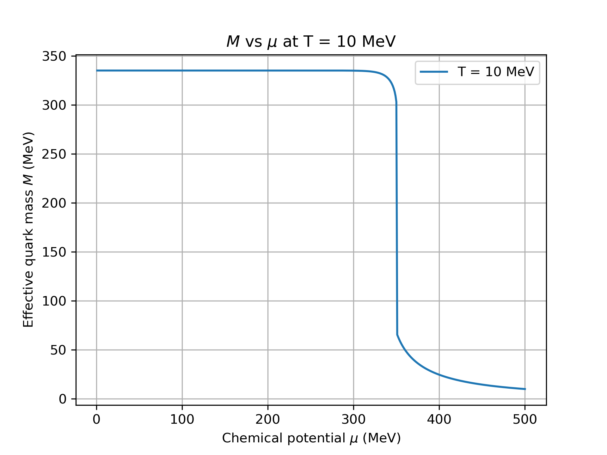
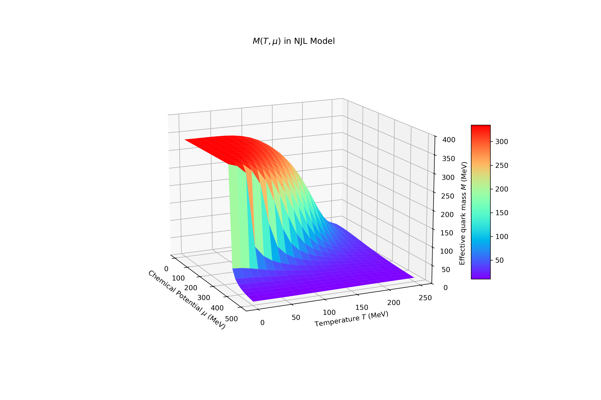
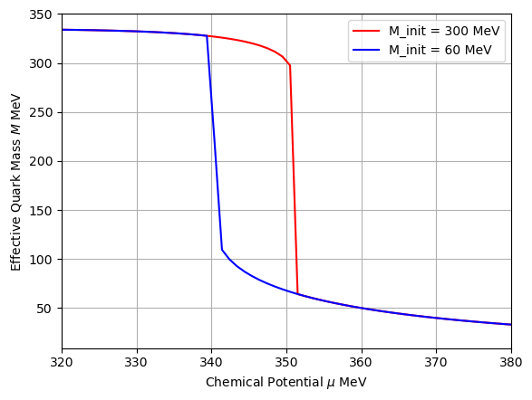

# NJL_Solver

NJL Solver 用于求解Nambu-Jona-Lasinio 模型。

## 运行结果

### 在T=10MeV下，有效夸克质量*M* 与 化学势$\mu$的关系：
<picture>  </picture>

### 有效夸克质量*M* 与 化学势$\mu$以及温度$T$的关系：
<picture>  </picture>

### T=10MeV 下的多解问题

